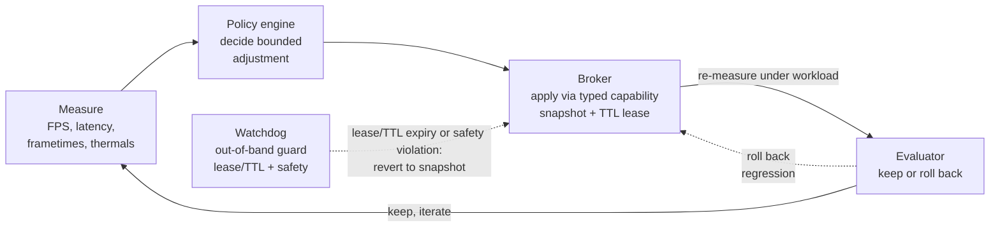

# FPSMaxxing

**Autonomous, measurement-driven system performance tuning.**

FPSMaxxing is an open-source Rust control plane for using an AI coding agent or LLM - such as Claude, Codex, or another MCP client - to improve gaming FPS, frame pacing, system latency, thermals, power efficiency, and compute throughput through bounded, reversible experiments.

> [!IMPORTANT]
> FPSMaxxing is currently a read-only alpha built around a mock provider.
> An MCP client can discover typed capabilities and run the full snapshot, preview, apply, verify, and rollback lifecycle, but FPSMaxxing does **not** perform real hardware writes, overclock a GPU, edit BIOS settings, or modify the Windows Registry yet.

## The closed loop

FPSMaxxing is designed as a closed feedback loop that tunes system and hardware performance through bounded, reversible experiments.



An MCP agent reaches the machine only through the unprivileged **gateway**, which exposes typed MCP tools instead of a shell, administrator credentials, or raw device access.
The gateway forwards a proposed experiment to the **capability registry and policy engine**, which intersects it with provider limits and reduces it to a single bounded, reversible adjustment.
The **privileged broker** is designed to apply that adjustment through a **provider sidecar**, always capturing a pre-state snapshot, holding a TTL lease, and recording every stage in the **durable experiment journal**.
An **independent watchdog** will own the lease deadline and restore the snapshot through the broker, without the gateway, agent, or experiment runner, whenever a lease expires or a safety violation appears.
In the target design the loop then re-measures under workload, and the **deterministic evaluator** - kept outside the LLM's writable surface - decides from those measurements whether to keep the change or roll back a regression before the next iteration begins.

## Why FPSMaxxing?

Existing tools already know how to control parts of a PC:

- Process Lasso manages process priorities, CPU sets, affinities, and power profiles.
- Fan Control manages fan curves and thermal response.
- PresentMon measures frame times, latency, and rendering performance.
- LibreHardwareMonitor reads clocks, temperatures, fan speeds, loads, and power.
- NVML and AMD SMI expose supported GPU telemetry and controls.
- Windows APIs expose power policy and documented Registry settings.

FPSMaxxing is intended to connect those control planes to a reproducible research loop:

```text
observe → propose → validate → snapshot → apply → benchmark → keep or rollback
```

The LLM proposes an experiment. Deterministic policy, broker, provider, watchdog, and measurement components decide whether the experiment is allowed and whether its measured result should be retained.

## Design principles

- **The model is never the root process.** Privileged changes pass through a small Rust broker.
- **Capabilities, not shell commands.** Agents call typed operations with bounded parameters.
- **Every write is leased.** Changes require a snapshot, verification probe, deadline, and rollback path.
- **One owner per knob.** Conflicting tuning applications cannot fight over the same setting.
- **Measurement beats folklore.** Changes survive only when repeated workload tests show a practical improvement.
- **Fast loops stay local.** Drivers and dedicated tools control millisecond-to-second behavior; the LLM operates at experiment cadence.

## Planned integrations

| Area | Initial provider | Intended use |
| --- | --- | --- |
| Process scheduling | Process Lasso | CPU affinity, CPU sets, priorities, process power profiles |
| Frame performance | PresentMon | FPS, frame time, latency, GPU telemetry |
| Hardware telemetry | LibreHardwareMonitor bridge | Temperatures, clocks, loads, power, fan RPM |
| Fan control | Fan Control | Complete, reviewed thermal profiles |
| NVIDIA GPU | NVML | Supported clock and power-limit operations |
| AMD GPU | AMD SMI | Supported telemetry and control operations |
| Windows power | Native Windows APIs | Cloned power schemes and processor policy |
| Registry | Curated catalog | Documented, typed, versioned, reversible settings only |

BIOS changes, voltage changes, raw MSR/PCI/EC access, firmware flashing, and arbitrary Registry paths are explicitly outside the first release.

## Repository status

The repository currently includes:

- A Rust 2024 Cargo workspace
- Shared capability and provider contracts
- A provider SDK lifecycle
- A working mock provider with snapshot/preview/apply/verify/rollback tests
- A control-plane crate holding the capability registry, bounded policy, broker lifecycle, and durable SQLite experiment journal
- A working stdio MCP gateway that serves the mock path end to end
- A CLI `doctor` command that reports gateway and journal status
- Scaffolds for the privileged broker, watchdog, and experiment runner
- OSS governance, security policy, issue templates, and CI
- An organized [documentation index](docs/README.md) with architecture, plans, threat model, and provider guides

Try the read-only alpha:

```bash
cargo test --workspace
cargo run -p fpsmaxxing-cli -- doctor
cargo run -p fpsmaxxing-mock-provider
printf '%s\n' \
  '{"jsonrpc":"2.0","id":1,"method":"tools/list","params":{}}' \
  '{"jsonrpc":"2.0","id":2,"method":"tools/call","params":{"name":"fpsmaxxing.run_mock_lifecycle","arguments":{"value":42,"lease_seconds":30}}}' \
  | cargo run -p fpsmaxxing-gateway
```

The gateway speaks line-delimited JSON-RPC (MCP) on stdio and journals every lifecycle stage attempt plus a terminal outcome to `fpsmaxxing-journal.sqlite` by default.
Override the journal location with `--journal <path>` or the `FPSMAXXING_JOURNAL_PATH` environment variable; `doctor` reads the same variable when reporting journal status.

## Architecture

```text
LLM / MCP client
       │
       ▼
Rust gateway ──► policy engine ──► privileged broker ──► provider sidecars
       ▲                                  ▲                      │
       │                           independent watchdog          │
telemetry normalizer ◄───────────────────────────────────────────┘
       │
       ▼
experiment journal and benchmark decision gate
```

## Documentation

Start with the [documentation index](docs/README.md). The core references are the [architecture](docs/ARCHITECTURE.md), implementation plan in [Markdown](docs/IMPLEMENTATION_PLAN.md) or [HTML](docs/IMPLEMENTATION_PLAN.html), [threat model](docs/threat-model/README.md), and [agent instructions](AGENTS.md).

## Frequently asked questions

### Can Claude optimize my PC for higher FPS?

That is the intended workflow. A Claude or Codex agent should be able to inspect available capabilities, propose a bounded change, run a controlled game or benchmark workload, and keep the change only when frame time, latency, thermals, and correctness remain within policy. The alpha already runs capability discovery and the bounded snapshot-to-rollback lifecycle over MCP against a mock provider; the measurement-driven keep-or-rollback decision and real hardware providers are not implemented yet.

### Can an AI safely overclock a GPU?

FPSMaxxing will not expose arbitrary voltage or register writes. Planned GPU operations use supported vendor APIs, query device limits first, require rollback, and run under an independent thermal watchdog. Persistent or high-risk operations require explicit approval.

### Is this an AI BIOS optimizer?

Not initially. Consumer BIOS settings are vendor-specific and can make a machine unbootable. Server firmware may eventually be supported through Redfish and boot recovery, but firmware autonomy is deliberately deferred.

### Does FPSMaxxing replace Process Lasso, Fan Control, or MSI Afterburner?

No. It is an orchestration and measurement layer. Where a stable third-party control plane exists, FPSMaxxing should integrate with it instead of reimplementing its hardware logic.

### Will it blindly apply Windows performance tweaks from the internet?

No. Registry and power changes must come from a curated catalog containing the supported Windows versions, exact value type, permitted values, verification method, risk class, and rollback procedure.

## Contributing

Read [CONTRIBUTING.md](CONTRIBUTING.md) and the current [implementation plan](docs/IMPLEMENTATION_PLAN.md) before starting a provider. Security-sensitive changes require tests for denial, timeout, lease expiry, verification failure, and rollback.

## Security

Do not open public issues for vulnerabilities that could enable arbitrary privileged execution or unsafe hardware writes. Follow [SECURITY.md](SECURITY.md).

## License

Licensed under the [Apache License 2.0](LICENSE).
