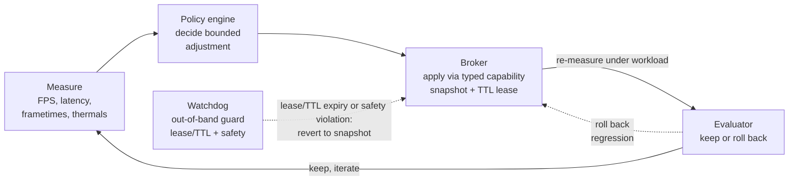

# FPSMaxxing

**Autonomous, measurement-driven system performance tuning.**

FPSMaxxing is an open-source Rust control plane for using an AI coding agent or LLM - such as Claude, Codex, or another MCP client - to improve gaming FPS, frame pacing, system latency, thermals, power efficiency, and compute throughput through bounded, reversible experiments.

> [!IMPORTANT]
> FPSMaxxing is currently a read-only alpha built around a mock provider.
> An MCP client can discover typed capabilities and run the full snapshot, preview, apply, verify, and rollback lifecycle, but FPSMaxxing does **not** perform real hardware writes, overclock a GPU, edit BIOS settings, or modify the Windows Registry yet.
> Measurement is a deterministic stand-in for live telemetry, and the gateway does not route through the privileged broker yet.
>
> Every claim below about what the system does is written in the present tense for what runs today on that mock path, and in the future tense for what does not exist yet; the design principles and the planned integrations state intent rather than status.
> Read every present-tense claim against this caveat rather than as a claim about real hardware.

## The closed loop

FPSMaxxing is designed as a closed feedback loop that tunes system and hardware performance through bounded, reversible experiments.



An MCP agent reaches the machine only through the unprivileged **gateway**, which exposes typed MCP tools instead of a shell, administrator credentials, or raw device access.
The gateway forwards a proposed experiment to the **capability registry and policy engine**, which intersects it with provider limits and reduces it to a single bounded, reversible adjustment.
The **privileged broker** applies that adjustment across the local IPC boundary, always capturing a pre-state snapshot, holding a TTL lease, and recording every stage in the **durable experiment journal**.
The gateway does not reach the broker over that boundary yet; today it drives a control plane of its own in process, under those same snapshot, lease, and journal rules.
The broker will reach the hardware through a **provider sidecar**; today that in-process control plane links its provider directly.
An **independent watchdog** owns the lease deadline and restores the snapshot from the journal, without the gateway, agent, or experiment runner, whenever a lease expires or a crash leaves an experiment unclosed.
It will perform that restore through the broker, and will also trigger on a safety violation.
The **deterministic evaluator** - kept outside the LLM's writable surface - decides from the recorded measurements whether the candidate is applied at all.
The loop will re-measure under workload inside the lease window; today it measures the candidate before the apply.
That same verdict will decide whether an improvement persists past its lease or is rolled back as a regression, and will drive the next iteration of the loop.

## Why FPSMaxxing?

Existing tools already know how to control parts of a PC:

- Process Lasso manages process priorities, CPU sets, affinities, and power profiles.
- Fan Control manages fan curves and thermal response.
- PresentMon measures frame times, latency, and rendering performance.
- LibreHardwareMonitor reads clocks, temperatures, fan speeds, loads, and power.
- NVML and AMD SMI expose supported GPU telemetry and controls.
- Windows APIs expose power policy and documented Registry settings.

FPSMaxxing will connect those control planes to the reproducible research loop described above; today only the mock provider is wired.
The LLM proposes an experiment.
Deterministic policy, broker, provider, watchdog, and measurement components decide whether the experiment is allowed and whether its measured result clears the evaluator.

## Design principles

- **The model is never the root process.** Privileged changes pass through a small Rust broker.
- **Capabilities, not shell commands.** Agents call typed operations with bounded parameters.
- **Every write is leased.** Changes require a snapshot, verification probe, deadline, and rollback path.
- **One owner per knob.** Conflicting tuning applications cannot fight over the same setting.
- **Measurement beats folklore.** Changes survive only when repeated workload tests show a practical improvement.
- **Fast loops stay local.** Drivers and dedicated tools control millisecond-to-second behavior; the LLM operates at experiment cadence.

## Planned integrations

| Area               | Initial provider            | Intended use                                               |
| ------------------ | --------------------------- | ---------------------------------------------------------- |
| Process scheduling | Process Lasso               | CPU affinity, CPU sets, priorities, process power profiles |
| Frame performance  | PresentMon                  | FPS, frame time, latency, GPU telemetry                    |
| Hardware telemetry | LibreHardwareMonitor bridge | Temperatures, clocks, loads, power, fan RPM                |
| Fan control        | Fan Control                 | Complete, reviewed thermal profiles                        |
| NVIDIA GPU         | NVML                        | Supported clock and power-limit operations                 |
| AMD GPU            | AMD SMI                     | Supported telemetry and control operations                 |
| Windows power      | Native Windows APIs         | Cloned power schemes and processor policy                  |
| Registry           | Curated catalog             | Documented, typed, versioned, reversible settings only     |

BIOS changes, voltage changes, raw MSR/PCI/EC access, firmware flashing, and arbitrary Registry paths are explicitly outside the first release.

## Repository status

FPSMaxxing is a Rust 2024 Cargo workspace with OSS governance, a security policy, issue templates, CI, and an organized [documentation index](docs/README.md) covering architecture, plans, threat model, broker operations, and provider guides.
Every stage of the closed loop above has a working implementation on the mock path, except what the walkthrough marks as future.
What ships today, by capability:

- **Capabilities and providers.** Shared capability and provider contracts, a provider SDK lifecycle, and a mock provider covering snapshot, preview, apply, verify, and rollback under test.
- **Policy and journal.** A control-plane crate holding the capability registry, bounded policy, broker lifecycle, and a durable SQLite experiment journal.
- **Agent surface.** A stdio MCP gateway that serves the mock path end to end, and a CLI `doctor` command that reports gateway and journal status.
- **Privileged boundary.** A broker that serves the control plane to authenticated local peers over an IPC boundary, on the Linux-safe path only.
- **Crash and lease recovery.** An independent watchdog that restores prior state from the journal after a crash or a lease expiry, on the Linux-safe mock path.
- **Measurement and decision.** A deterministic experiment runner that gates measured trials through an immutable evaluator and replays them from the journal alone.

Everything the walkthrough above states in the future tense is still ahead of us.
So are real hardware providers and live frame-time measurement.

Try the read-only alpha:

```bash
cargo test --workspace
cargo run -p fpsmaxxing-cli -- doctor
cargo run -p fpsmaxxing-mock-provider
cargo run -p fpsmaxxing-experiment-runner
printf '%s\n' \
  '{"jsonrpc":"2.0","id":1,"method":"tools/list","params":{}}' \
  '{"jsonrpc":"2.0","id":2,"method":"tools/call","params":{"name":"fpsmaxxing.run_mock_lifecycle","arguments":{"value":42,"lease_seconds":30}}}' \
  | cargo run -p fpsmaxxing-gateway
```

The gateway speaks line-delimited JSON-RPC (MCP) on stdio and journals every lifecycle stage attempt plus a terminal outcome to `fpsmaxxing-journal.sqlite` by default.
Override the journal location with `--journal <path>` or the `FPSMAXXING_JOURNAL_PATH` environment variable; `doctor` reads the same variable when reporting journal status.
`FPSMAXXING_JOURNAL_PATH` belongs to the unprivileged tools - the gateway, the CLI, and the watchdog - and the privileged broker deliberately does not read it.

Run the watchdog against the same journal to reclaim leaked experiments: `cargo run -p fpsmaxxing-watchdog -- --once` performs a single expired-lease pass and `--recover-all` rolls back every unclosed experiment after a crash.
It accepts the same `--journal <path>` and `FPSMAXXING_JOURNAL_PATH` overrides, plus `--interval <seconds>` for its steady-state poll loop.

The experiment runner measures a baseline and a candidate against a deterministic stand-in for live telemetry, gates the candidate's lifecycle on the immutable evaluator's verdict, journals the trial with its spec, samples, and verdict, then replays it from the journal alone and checks the re-evaluated verdict against the recorded one.
It is a demonstration binary rather than an MCP tool, takes no arguments, and journals to an in-memory SQLite database, so it leaves nothing on disk and exits non-zero if a replay diverges from the journal, falls outside the policy gate, or the broker refuses a promoted lifecycle.

### Privileged broker

`fpsmaxxing-broker` is the trusted side of the local IPC boundary: it serves capability discovery and the bounded provider lifecycle to authenticated local peers over a Unix domain socket, and refuses to run on Windows because the Windows named-pipe transport is not yet available.
The gateway does not connect to it yet, so the broker path is exercised by the `BrokerClient` in `crates/ipc` and its end-to-end tests in `apps/broker/tests/integration.rs` rather than by the MCP command above.
[Broker operations and deployment](docs/BROKER_OPERATIONS.md) covers running it directly: socket, journal, and lock paths, private-directory ownership rules, and systemd RuntimeDirectory settings.

```bash
cargo run -p fpsmaxxing-broker
cargo run -p fpsmaxxing-broker -- --help
```

## Documentation

Start with the [documentation index](docs/README.md). The core references are the [architecture](docs/ARCHITECTURE.md), implementation plan in [Markdown](docs/IMPLEMENTATION_PLAN.md) or [HTML](docs/IMPLEMENTATION_PLAN.html), [threat model](docs/threat-model/README.md), and [agent instructions](AGENTS.md).

## Frequently asked questions

### Can Claude optimize my PC for higher FPS?

That is the intended workflow.
A Claude or Codex agent should be able to inspect available capabilities, propose a bounded change, run a controlled game or benchmark workload, and keep the change only when frame time, latency, thermals, and correctness remain within policy.

Not yet on real hardware.
The alpha runs capability discovery and the bounded snapshot-to-rollback lifecycle over MCP against a mock provider, and it promotes or rejects one measured experiment through an immutable evaluator that decides from recorded samples and fixed bounds alone.
Real hardware providers, live frame-time measurement, and a promotion that survives its lease are not implemented yet: the alpha measures a deterministic stand-in for telemetry, and the verdict gates whether a candidate is applied at all rather than whether it persists.

### Can an AI safely overclock a GPU?

FPSMaxxing will not expose arbitrary voltage or register writes. Planned GPU operations use supported vendor APIs, query device limits first, require rollback, and run under an independent thermal watchdog. Persistent or high-risk operations require explicit approval.

### Is this an AI BIOS optimizer?

Not initially. Consumer BIOS settings are vendor-specific and can make a machine unbootable. Server firmware may eventually be supported through Redfish and boot recovery, but firmware autonomy is deliberately deferred.

### Does FPSMaxxing replace Process Lasso, Fan Control, or MSI Afterburner?

No. It is an orchestration and measurement layer. Where a stable third-party control plane exists, FPSMaxxing should integrate with it instead of reimplementing its hardware logic.

### Will it blindly apply Windows performance tweaks from the internet?

No. Registry and power changes must come from a curated catalog containing the supported Windows versions, exact value type, permitted values, verification method, risk class, and rollback procedure.

## Contributing

Read [CONTRIBUTING.md](CONTRIBUTING.md) and the current [implementation plan](docs/IMPLEMENTATION_PLAN.md) before starting a provider. Security-sensitive changes require tests for denial, timeout, lease expiry, verification failure, and rollback.

## Security

Do not open public issues for vulnerabilities that could enable arbitrary privileged execution or unsafe hardware writes. Follow [SECURITY.md](SECURITY.md).

## License

Licensed under the [Apache License 2.0](LICENSE).
